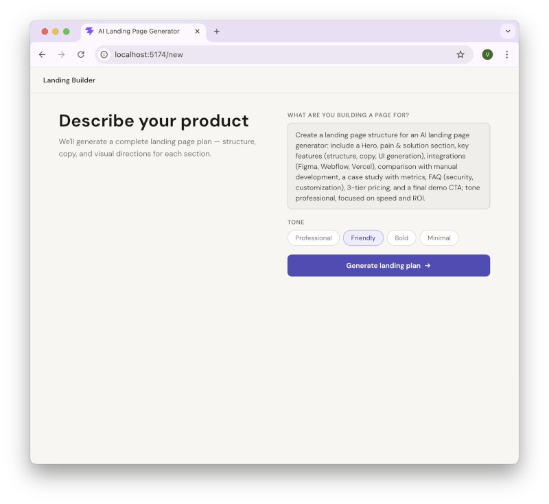

# Landing Page Builder

An AI-powered web app that turns a product description into a complete landing page — with a structured review step before generation.

**Live demo:** `https://<your-vercel-domain>.vercel.app` (replace with actual URL)

---

## What it does

1. User describes a product in free text and picks a tone
2. AI generates a structured landing page plan: sections, copy, and visual directions for each section
3. User reviews the plan, edits any section if needed, then approves
4. AI generates the final landing page from the approved plan

## Demo



---

## Tech stack

| Layer | Technology |
|-------|-----------|
| Frontend | Vite + React + TypeScript |
| Backend | FastAPI (Python) |
| LLM | Anthropic Claude API + OpenAI Responses API |
| Deploy | Vercel (frontend) + Railway (backend) |

---

## How to run locally

**Prerequisites:** Node.js 18+, Python 3.11+, Anthropic and/or OpenAI API key (depends on provider settings)

```bash
# Clone
git clone https://github.com/<your-username>/AI-Landing-Page-Generator
cd AI-Landing-Page-Generator

# Backend
cd backend
cp .env.example .env          # set token/cors/limits and provider config
# Required vars in backend/.env:
#   ANONYMOUS_TOKEN=any-secret-string
#   INPUT_PROMPT_MAX_CHARS=1000
#   ALLOWED_ORIGINS=http://localhost:5173
#   PLAN_LLM_PROVIDER=anthropic|openai
#   PARSE_LLM_PROVIDER=anthropic|openai
#   ANTHROPIC_API_KEY=...      # required when provider is anthropic
#   OPENAI_API_KEY=...         # required when provider is openai
pip install -r requirements.txt
uvicorn main:app --reload --port 8000

# Frontend (new terminal)
cd frontend
cp .env.example .env          # set VITE_API_URL and VITE_ANONYMOUS_TOKEN
# Required vars in frontend/.env:
#   VITE_API_URL=http://localhost:8000
#   VITE_ANONYMOUS_TOKEN=any-secret-string  # must match backend ANONYMOUS_TOKEN
npm install
npm run dev                   # http://localhost:5173
```

---

## Architecture

### User flow

```
Screen 1.1  Prompt input
    ↓
Screen 1.2  Generating popup  ←  LLM Call 1 (PLAN_LLM_PROVIDER)
    ↓
Screen 3.1  Review plan (approve or edit)
    ↓ (optional)
Screen 3.2  Edit section
Screen 3.3  Save popup        ←  LLM Call 1b (PARSE_LLM_PROVIDER)
    ↓
Screen 4    Final landing page  ←  LLM Call 2 (Sonnet, Anthropic)
```

Full details: [`docs/01-user-flow.md`](docs/01-user-flow.md)

### LLM pipeline

| Call | Model | Trigger | Purpose |
|------|-------|---------|---------|
| Call 1 | `PLAN_LLM_PROVIDER` | "Generate landing plan" | Prompt → structured plan JSON |
| Call 1b | `PARSE_LLM_PROVIDER` | "Re-generate" in edit popup | Re-parse edited section (optional) |
| Call 2 | Sonnet (Anthropic) | "Approve & generate page" | Plan → final landing page HTML |

Full details: [`docs/02-llm-plan.md`](docs/02-llm-plan.md)

### Stack and folder structure

Full details: [`docs/03-architecture.md`](docs/03-architecture.md)

---

## Design decisions

**Two-step pipeline (plan → page)**

A single prompt-to-page call produces generic output — the model tries to do everything at once. Separating plan generation from page generation lets Call 1 focus on structure and strategy, and Call 2 focus on execution. The plan JSON acts as a contract between the two calls.

**User approval as a gate**

The "Approve & generate page" button is the explicit approval gate. Users can edit any section before approving — but the heavier Call 2 only fires after they commit. This avoids wasted generation on a plan the user would have changed anyway.

**Free-text editing over structured fields**

Section editing uses a single textarea with pre-filled structured text (`Headline: ...\nVisual: ...`) rather than individual input fields per property. This is simpler to build, easier to use, and maps naturally to a lightweight LLM re-parse (Call 1b) on save. The user edits a prompt — not a form.

**Standalone HTML preview**

Call 2 returns a complete HTML document (`{ html: string }`), and the frontend renders it in a sandboxed iframe (`srcdoc`). This keeps preview rendering isolated from the app shell and avoids direct DOM injection into the parent UI.

**Lightweight parse model for re-parse**

Call 1b is deterministic (labeled text → JSON), so this stage is optimized for latency/cost and can use a cheaper provider/model via `PARSE_LLM_PROVIDER`.

**Prompts as files**

System prompts live in `backend/prompts/*.txt`, loaded at startup. This separates prompt engineering from application logic — prompts can be iterated without touching Python code.

**Input guardrails for MVP safety**

Backend validates prompts before calling the LLM: max length via `INPUT_PROMPT_MAX_CHARS` (fallback `PROMPT_MAX_CHARS`), landing-page topic gating, and red-flag blocking (exploit/malware/SQLi/prompt-leak/command-execution intent). Invalid input returns `400` with a structured error response.

---

## How AI tools were used during development

- Used AI coding assistants (Codex/Claude Code style workflow) to scaffold backend routers/schemas/services and frontend page/component structure.
- Iterated prompts (`backend/prompts/*.txt`) with AI to improve output format stability and landing-page quality.
- Used AI for refactoring and consistency passes (typed API client, error mapping, session flow, and UI state wiring).
- Kept human review on architecture choices, acceptance criteria, and security/guardrail behavior.

---

## Intentional simplifications (6-hour scope)

- Simplified generation pipeline to **2 core calls + 1 optional parse call** (no multi-agent research or critique/refine loops).
- Used lightweight anonymous-token auth (`x-anonymous-token`) instead of full user accounts/session auth.
- Kept UI intentionally minimal (single app flow, simple popups/cards, no visual editor/CMS).
- Used `sessionStorage` for state persistence instead of database/user workspaces.
- Returned full HTML in one response and rendered via sandboxed `iframe` (no component-level renderer/template engine).
- Deferred a dedicated planning agent step before Call 1 (for disambiguation and enrichment when user input is sparse), to keep the MVP pipeline fast and simple.
- Deferred advanced production features: rate-limiting layer, background jobs, observability dashboards, and full automated test suite.

---

## Project docs

- [`docs/01-user-flow.md`](docs/01-user-flow.md) — screen-by-screen user flow with LLM call specs
- [`docs/02-llm-plan.md`](docs/02-llm-plan.md) — LLM architecture, models, input/output schemas
- [`docs/03-architecture.md`](docs/03-architecture.md) — stack, folder structure, endpoints, deploy
- [`docs/04-backend-task.md`](docs/04-backend-task.md) — backend implementation task and acceptance criteria
- [`docs/05-frontend-task.md`](docs/05-frontend-task.md) — frontend implementation task and acceptance criteria
